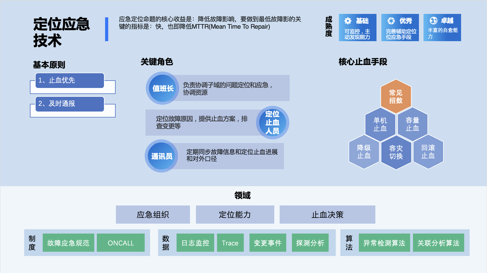
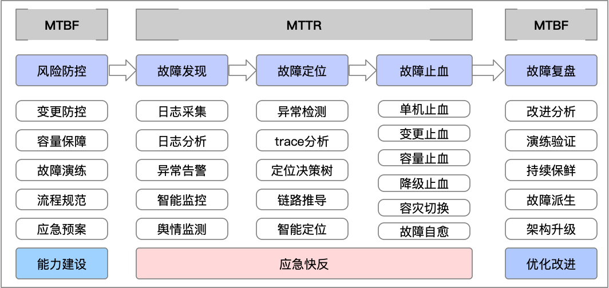
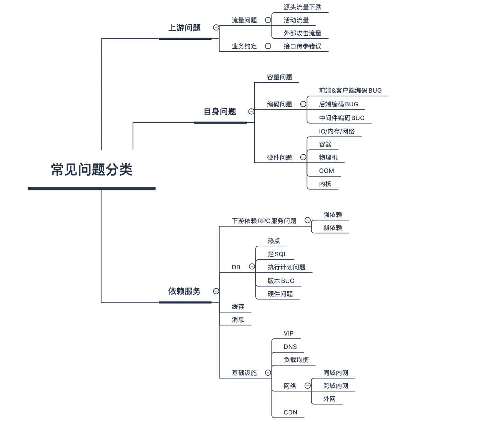

_本篇的目标读者是在服务运维中做定位应急的一线人员和负责人、以及定位应急平台相关的开发人员。目标是和大家分享一些在定位应急中的原则和经验，包括平台化和智能化的一些实践。_

## 一、应急定位概述
应急定位在通常的运维三大方向“稳定、效率、成本”中属于“稳定”&“效率”部分，稳定是目标，效率是做的方式。应急定位在故障的生命周期中处于故障的处置阶段，属于事后“救火”环节。应急定位命题的核心收益是：**降低故障影响**，怎么做到降低故障影响？关键的指标是：快，也即降低MTTR(Mean Time To Repair)，所有事情都是围绕在故障发生后怎么更快的恢复，降低影响来做。

下面将围绕故障应急的各个环节来分析怎么做来降低MTTR，分享一些我们在实际运维过程中的经验
## 二、应急定位实践
#### 应急准备
        应急人员需要在日常储备相应的应急知识：业务链路熟悉、操作平台和工具熟悉、应急操作权限申请，做到有备无患，可通过日常演练和考试来加强和考验人员的能力水平。
#### 标准的应急机制和分工
        参考《Google运维解密》一书中紧急事故的流程管理要素并结合我们实际经验，故障应急中包含的角色通常有下面几种，在故障应急中需要各司其职，有条不紊做好分工，才能提升故障处置效率，避免因为协同问题导致故障处理延迟，浪费定位止血时间。在影响越大的故障中，角色明确分工就显得越重要。

- 指挥员：指挥全局，对一些重大预案做决策尤其是一些有损预案进行决策
- 通信员：启动应急流程，组织拉起相关人员应急，负责定期同步故障信息和定位止血进展和对外口径
- 值班长：负责协调子域的问题定位和应急，和指挥员进行充分沟通，负责指挥子团队内问题定位排查
- 定位排查人员：负责定位故障的原因，提供止血方案的一线人员，在定位人员中还可以进一步分工，有的负责查变更，有的负责查流量问题等等

结合公司实际的组织架构，可以进一步按层划分。在实际故障应急中，依据故障大小和涉及的人员规模可以灵活调整，比如对于小故障一个人可以身兼数职，但有一点要注意当我们发现力不从心时，这时候切忌硬抗需要立即拉起更多的人员进来。实际中需要按照故障影响启动不同级别的应急响应机制。另外关于应急操作，如果日常操作审批流程较为复杂，最好设立有专门的应急操作流程入口提升应急操作的速度。

在这里面有几个关键问题，也是降低MTTR的关键点

1. 怎么更快的找人并且找对人？

        在实际应急中我们发现，从故障发生到找对人并且找到人往往要花费不少时间，业务系统报警后常常是下游依赖服务或者基础设施的问题，做为业务系统的运维人员疑惑该找谁谁在值班，打电话后对方回答当前不是他oncall，让你找某某，每次外呼都要重复描述一遍当前问题，往往要经过多个串行呼叫才能找到对的人，对应负责人上线后又要重新梳理问题，这个时候离报警发生已经过去好几分钟了，浪费了不少应急时间。在系统化解决这个问题之前更多要通过流程和规范来约束比如有明确的oncall机制，公示的值班表便于快速找到人。

2. 怎么更快的判断故障影响面？

        应急人员在应急过程中精力有限，通常重心在定位和止血上，无法保证每时每刻都分心关注当前业务指标的变化情况，当前累积影响数是多少，持续时间多长，是好转还是进一步恶化。而这些影响数据在应急中至关重要，对于有明确SLA的业务直接决定是要启动执行某些预案，同时也决定是否需要提升故障级别和应急响应级别。另外一个子域的应急人员往往只能看到自己子域的问题，无法及时判断对上下游的影响和哪些人员已经在应急该问题。在缺乏系统化解决方案之前最好要有一名人员专门时刻关注上下游影响面信息，故障恢复与恶化情况。
#### 故障定位止血
        常见的问题根因有以下几类：

        在应急过程中，根因定位花费的时间可能很长，定位根因的主要目的是为了避免下次再发生同样故障，但为了快速恢复我们首先要做的定位是辅助止血，我们称之为"**止血定位**"，根因定位也是必要的但是在止血后进行。
        应急定位过程中，一个最重要的原则是：**止血优先，**止血前定位的目标是定位找到可以止血的手段，定位根因是其次，比如：发布导致的故障，找到疑似变更后并不需要第一时间去确定该次发布的代码为什么会引发故障，可以通过时间线比对的方法确定变更导致的可能性，基于止血优先的原则评估回滚影响后即可对发布进行快速的回滚止血；单机故障，我们应急时只需要找到异常的单机即可，至于单机异常的根因定位放在单机止血后进行；机房网络故障，定位首先要做的是确定故障的机房和影响面辅助决策执行容灾切换，恢复后再进行机房网络故障的根因定位。应急中虽然是止血优先，但是也要注意防止误操作带来次生伤害，要经过灰度到全量的验证，应急操作要double check。
        从广义上说，所有故障都是由某个“变化”触发，而且这个“变化”大多数时候都是一个（可能是多个因子联合导致，但是在最终触发故障的最后一环肯定是一个），这个“变化”可能是变更人员做的代码发布，也可能是某个网络设备老化宕机，也可能是秒杀活动导致流量突增，有些变化是可逆的，有些变化是不可逆的。相比于根因定位，在应急阶段找到这个“**变化”的初始因子**显得更为重要。定位的一个核心思路就是理清从初始“变化”因子到故障产生的路径上的传导链路，这里面我们常用到曲线异常识别、相关性分析、链路分析等方法。可以定位到初始的“变化”因子当然很好，如果这个“变化”是可逆的那么通常将因子的“变化”回滚即可恢复。但还会遇到两种情况：1.初始的变化因子不可逆或者短时间不可逆，2.定位不到初始变化因子。比如：机房网络设备老化，做为上层服务使用方我们短时间是定位不到这个因子的，即使定位到了该操作短时间也是不可逆的。幸运的是我们只需要切断故障传导链路上的任何一个因子都可以进行止血，每个因子节点都可以有对应的止血手段。依据经验我们梳理出常见的五类止血招数

- 单机止血

服务器都有一定的故障率，单机类问题是日常运维中最为常见的一类问题，不管是上层应用服务还是底层的存储服务等基础设施都可能出现单机问题。单机类问题中我们要以业务现象为主，机器系统指标为辅：比如先看rpc访问失败数再看cpu负载等指标，因为实际中可能发生机器A的cpu负载并不是最高，但是访问失败都集中在机器A，此时要做的是把机器A下线或者关流。对单机类常见的止血手段有：重启、关流、替换，偏服务进程方面的异常使用重启，偏机器方面的异常使用关流/替换。在单机问题定位中常用算法：离群点识别算法。

- 容量止血

导致容量问题的常见原因有几种：流量上升、程序性能下降。其中程序性能下降的原因：自身代码bug、依赖服务耗时增大，相应的止血手段如下：

其中再说明几点，扩容：可以日常准备一个应急资源池，保障应急扩容时的顺畅，避免资源不足影响应急速度，并在应急结束后及时回收资源保障应急集群可用；重启：服务重启耗时过长将会影响应急时效性，耗时过长的需要在日常优化。

- 变更止血

在实际应急中我们发现变更故障占了很大比例，这里的变更主要指人对生产系统做的任何操作，包括但不限于代码发布、配置和环境的增删改，为了保障变更的可快速应急，在变更规范中我们约束变更人要求变更都是可应急的（可回滚或者开关）

在实际中我们发现在变更类应急中，变更事件的定位是应急中主要难点和耗时点，首先需要一个手段可以快速查到所有变更（比如建一个变更收集平台），然而在业务链路复杂后会发现在一个时间段内发生的变更数量很多，如何从这些变更中定位到引起故障的变更就像大海捞针，常用的定位办法有：时间点匹配、变更和未变更机器指标对比、变更程序分析、基于知识图谱的变更定位。若在短时间内无法定位，对影响太大的故障权衡后可以采用“饱和式”应急，将附近时间点的疑似变更全都回滚，但有带来次生伤害的风险。

- 降级止血

降级止血本质是为了在故障应急中保障业务的持续可用的一种“放小保大”行为，从预案准备到决策执行都是和业务属性强相关的，特点是：不具备通用性、有损。在业务开发阶段就要设计并做演练验证降级的有效性，在执行阶段因为是有损预案，执行后往往会带来其他风险，常见的比如：“用户体验的影响”、“监管合规的风险”、“资损的风险”、“某些非核心业务的不可用的风险”，如果没有事先进行约定，在故障应急中降级预案的执行会变得无人敢决策或者决策流程时间特别长，如果执行时评估不到位可能会带来更大的受损变成“放大保小”，所以要做好降级止血，有部分工作是在事前就要明确掉，其次假设事前把预案执行的SLA都明确了，在故障发生后，如果缺乏系统化解决方案，应急人员需要翻看之前SLA约定，逐个排查各项条件是否符合约定，来决策是否要立即执行降级开关。

- 容灾切换
:::info
2018年杭州云栖大会ATEC主论坛现场上演了一场特别的技术秀，蚂蚁CTO现场模拟挖断支付宝近一半服务器的光缆，结果只过了26秒，模拟环境中的支付宝就完全恢复了正常！
:::
上面这个演示就是基于机房容灾切换技术，容灾切换是故障应急的终极大招，应对的是机房级故障，或者影响较大但没有找到其他好的止血手段同时又有单机房故障特征使用。机房容灾切流背后依赖的基建技术是“多活”技术，比如常见的“同城双活”、“异地多活”、“两地三中心”、“三地五中心”等。

容灾切换中有些需要注意的点：如果是异地切换，要注意切换后网络耗时增加的影响；对缓存类切换要注意缓存预热的问题；切换后要实时关注容量风险，切换过程最好也是一个灰度逐步的过程避免打爆目标机房；在日常定期进行容灾切换演练保鲜，确保“战时可用”。如何精准的做好容灾切换止血决策，做到又准又快，既不能无脑切又不能该切的时候切慢了，不能无脑切的原因是容灾切换可能带来一些体验降级，耗时增加，部分服务需要降级的问题。容灾切换通常用于应对的故障场景是：网络故障、机房大面积基础设施故障、影响面过大的其它故障。容灾切换定位决策中常见的需要考虑点如下：1. 判断影响面为单机房故障且影响面达到约定的切换SLA，快速定位到故障机房；2. 故障和业务流量成份&容量无关，避免切哪哪挂的尴尬情况发生。
## 三、平台化和智能化实践
### 一站式应急管理平台-极光
为了提升在应急中的找人、应急协同、信息同步等的效率，并提供辅助定位止血决策信息，做到一站式应急，我们建设了一个综合应急管理平台：极光应急管理平台，从故障响应到故障止血完成，都由该平台进行串联。极光通过平台落地标准的应急过程，将技术风险的各种应急能力都串联起来，聚合应急关联的信息，来提升应急oncall的效率，我们将整个应急过程，抽象成了三个标准的应急模块：应急组织、辅助定位决策、快捷止血操作。

主要核心能力如下，对上节提到的一些降低应急MTTR的一些关键难点都有一些相应方案：
#### 应急组织
应急组织主要是事前准备的内容，包括了应急事件统一接入、应急组织架构和应急响应机制，通过业务域、应用进行关联，用以提升应急过程中进行应急人员组织的效率，其主要能力包含以下几部分：

- 应急事件统一接入：收口各种告警事件，对各类应急发现能力的告警进行聚合，形成标准的应急事件，同时根据渠道、事件的不同，对应急事件进行不同的分级。
- 业务域应急管理：包含业务域关联业务配置、业务域值班表配置、业务域通知渠道配置、告警升级机制配置等能力，用于将应急事件和各个业务域、值班长、应急群、升级告警电话关联起来。
- 应急响应机制：对于投递出的应急事件，建立起响应反馈机制，使得平台能感知到每一个应急事件的响应处理状态，对于高级的事件，如果在3分钟之类如果没有人响应，还会通过告警升级机制，触达更高层的应急人员，保障问题的处理效率。
#### 定位能力

- 通用定位能力
   - 基于trace链路分析的根因推导
   - 单应用通用定位
- 个性化定位能力
   - 定位决策树
#### 止血决策

- 故障自愈
#### 应急指标数字化
通过以上标准化的流程机制建设，我们可以对应急过程中的时间分布进行精准的数字化衡量。对于每周的应急事件的统计，我们可以知道各个业务域的应急事件数量、应急响应率、定位时长、止血时长等，通过对这些指标建设跟踪机制进行持续改进，能够让我们更深刻的洞察目前的应急短板在哪，从而能够制定针对性的改进措施来不断的提升我们的应急效能。
## 附1、常用的开源技术和工具

- [Arthas-Alibaba 开源的 Java 诊断工具，深受开发者喜爱](https://arthas.aliyun.com/doc/)
